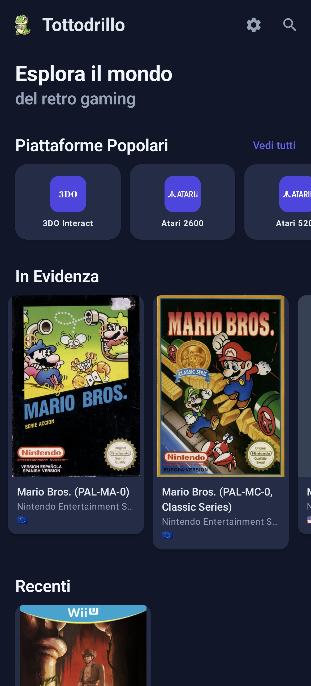

# Tottodrillo 🎮


**Tottodrillo** ist eine moderne und minimale Android-App zum Erkunden, Suchen und Herunterladen von ROMs von [CrocDB](https://crocdb.net), der öffentlichen Retro-Gaming-Datenbank.

## 🌍 Andere Sprachen / Other Languages

Dieses README ist auch in anderen Sprachen verfügbar:

- [🇬🇧 English](README.md)
- [🇮🇹 Italiano](README.it.md)
- [🇪🇸 Español](README.es.md)
- [🇯🇵 日本語](README.ja.md)
- [🇫🇷 Français](README.fr.md)
- [🇨🇳 简体中文](README.zh-CN.md)
- [🇵🇹 Português](README.pt.md)

---

## ✨ Hauptfunktionen

### 🎮 IGDB-Integration (NEU in v2.7.0)
- **Metadaten-Import**: Suche und importiere umfangreiche Metadaten für deine ROMs aus der Internet Game Database (IGDB)
- **Umfassende Spielinformationen**: Importiere Titel, Cover, Beschreibung, Handlung, Genres, Entwickler, Publisher, Bewertung, Screenshots und mehr
- **Einfache Konfiguration**: Richte deine IGDB Client ID und Secret direkt in den Einstellungen ein
- **Intelligente Übereinstimmung**: Zeige passende Plattformen an und bestätige vor dem Importieren von Metadaten
- **Erweiterte ROM-Details**: Bereichere deine ROM-Sammlung mit professionellen Metadaten und hochwertigen Covers von IGDB

### 🔍 ROM-Info-Suche
- **Mehrere Suchanbieter**: Wähle zwischen Gamefaqs und MobyGames für die ROM-Informationssuche
- **Konfigurierbarer Anbieter**: Wähle deinen bevorzugten Suchanbieter in den Einstellungen
- **Gamefaqs-Integration**: Suche ROM-Informationen direkt auf Gamefaqs
- **MobyGames-Integration**: Suche ROM-Informationen auf MobyGames
- **Dynamischer Button-Text**: Der Suchbutton-Text ändert sich basierend auf dem ausgewählten Anbieter

### 🔍 Erkundung & Suche
- **Startbildschirm** mit empfohlenen ROMs, beliebten Plattformen, Favoriten und kürzlichen ROMs
- **Plattform-Erkundung** organisiert nach Marken (Nintendo, PlayStation, Sega, Xbox, etc.) mit zusammenklappbaren/erweiterbaren Abschnitten
- **Erweiterte Suche** mit automatischem Debounce (500ms) zur Optimierung der Abfragen
- **Mehrfachfilter** für Plattformen und Regionen mit interaktiven Chips
- **Unendliche Paginierung** mit automatischem Lazy Loading
- **ROM-Anzeige** mit zentrierten und proportionalen Cover-Bildern

### 📥 Download & Installation
- **Hintergrund-Downloads** mit WorkManager für Zuverlässigkeit
- **Echtzeit-Fortschrittsverfolgung** mit Prozentangabe, heruntergeladenen Bytes und Geschwindigkeit
- **Interaktive Benachrichtigungen** mit Aktionen "Download abbrechen" und "Installation abbrechen"
- **Benutzerdefinierter Pfad** zum Speichern von Dateien in jedem Ordner (einschließlich externer SD-Karte)
- **Automatische/Manuelle Installation**:
  - Unterstützung für ZIP-Archive (Extraktion)
  - Unterstützung für Nicht-Archiv-Dateien (Kopieren/Verschieben)
  - Ordnerauswahl für benutzerdefiniertes Ziel
- **ES-DE-Kompatibilität**:
  - Automatische Installation in ES-DE-Ordnerstruktur
  - ES-DE-ROMs-Ordnerauswahl
  - Automatische Organisation nach `mother_code` (z.B. `fds/`, `nes/`, etc.)
- **Dateiverwaltung**:
  - Überschreiben vorhandener Dateien (löscht keine anderen Dateien im Ordner)
  - Optionale Löschung der Originaldatei nach Installation
  - Download- und Extraktionsverlauf-Verwaltung
- **Erweiterte Optionen**:
  - Nur-WiFi-Downloads zum Sparen mobiler Daten
  - Verfügbarer Speicherplatz-Verifizierung vor dem Download
  - Konfigurierbare Benachrichtigungen

### 💾 ROM-Verwaltung
- **Favoriten** mit dateibasierter Persistenz
- **Kürzliche ROMs** (letzte 25 geöffnete) mit dateibasierter Persistenz
- **Download/Installations-Status** für jeden Link mit automatischen Updates
- **Status-Icons**:
  - Download läuft mit Fortschrittsanzeige
  - Installation läuft mit Prozentangabe
  - Installation abgeschlossen (grünes Icon)
  - Installation fehlgeschlagen (rotes Icon, anklickbar zum Wiederholen)
- **Installationsordner öffnen** direkt aus der App

### 🎨 Design & UI
- **Material Design 3** mit automatischem Dark/Light-Theme
- **Minimalistische und moderne** Benutzeroberfläche
- **Flüssige Animationen** mit Jetpack Compose
- **Cover-Bilder** mit Lazy Loading (Coil) und automatischer Zentrierung
- **Plattform-Logos** SVG aus Assets geladen mit Fallback
- **Regions-Badges** mit Emoji-Flaggen
- **ROM-Karten** mit einheitlicher maximaler Breite (180dp)

### ⚙️ Einstellungen (Neu gestaltet in v2.7.0)
- **Baumstruktur mit erweiterbaren Gruppen**: Einstellungen in 8 zusammenklappbare Kategorien organisiert für bessere Navigation
- **ROM-Info-Suche**:
  - Suchanbieter wählen (Gamefaqs oder MobyGames)
  - Gamefaqs ist der Standardanbieter
  - IGDB-Integrations-Einstellungen (Client ID und Secret-Konfiguration)
- **Download-Konfiguration**:
  - Benutzerdefinierte Download-Ordnerauswahl
  - Verfügbarer Speicherplatz-Anzeige
  - Speicherberechtigungs-Verwaltung (Android 11+)
  - Nur-WiFi-Downloads
  - Benachrichtigungen ein/aus (für Downloads, Installationen und Updates)
- **Installations-Konfiguration**:
  - Originaldatei nach Installation löschen
  - ES-DE-Kompatibilität mit Ordnerauswahl
- **Verlaufsverwaltung**:
  - Download- und Installationsverlauf löschen (mit Bestätigung)
- **App-Informationen** (Immer sichtbar):
  - App-Version
  - GitHub-Link
  - Support-Bereich

## 📱 Screenshots



## 🏗️ Architektur

Die App folgt **Clean Architecture** mit Schichtentrennung:

```
app/
├── data/
│   ├── mapper/              # API → Domain Konvertierung
│   ├── model/               # Datenmodelle (API, Platform)
│   ├── remote/               # Retrofit, API-Service
│   ├── repository/           # Repository-Implementierungen
│   ├── receiver/             # BroadcastReceiver für Benachrichtigungen
│   └── worker/               # WorkManager Workers (Download, Extraction)
├── domain/
│   ├── manager/              # Geschäftslogik-Manager (Download, Platform)
│   ├── model/                # Domain-Modelle (UI)
│   └── repository/           # Repository-Interfaces
└── presentation/
    ├── components/            # Wiederverwendbare UI-Komponenten
    ├── common/                # UI State-Klassen
    ├── detail/                # ROM-Detailbildschirm
    ├── downloads/             # Download-Bildschirm
    ├── explore/               # Plattform-Erkundungsbildschirm
    ├── home/                  # Startbildschirm
    ├── navigation/            # Navigationsgraph
    ├── platform/              # ROMs nach Plattform-Bildschirm
    ├── search/                # Suchbildschirm
    ├── settings/              # Einstellungsbildschirm
    └── theme/                 # Theme-System
```

## 🛠️ Tech Stack

### Core
- **Kotlin** - Primäre Sprache
- **Jetpack Compose** - Modernes UI-Toolkit
- **Material 3** - Design-System

### Architektur
- **MVVM** - Architekturmuster
- **Hilt** - Dependency Injection
- **Coroutines & Flow** - Nebenläufigkeit und Reaktivität
- **StateFlow** - Reaktives State Management

### Netzwerk
- **Retrofit** - HTTP-Client
- **OkHttp** - Netzwerk-Schicht
- **Gson** - JSON-Parsing
- **Coil** - Bildladen mit SVG-Unterstützung

### Speicher & Persistenz
- **DataStore** - Persistente Einstellungen
- **WorkManager** - Zuverlässige Hintergrundaufgaben
- **File I/O** - `.status`-Dateiverwaltung für Download/Installations-Tracking

### Navigation
- **Navigation Compose** - Bildschirm-Routing
- **Safe Navigation** - Back-Stack-Verwaltung zur Vermeidung leerer Bildschirme

### Hintergrundaufgaben
- **DownloadWorker** - Datei-Download im Hintergrund mit Foreground-Service
- **ExtractionWorker** - Datei-Extraktion/Kopie im Hintergrund
- **Foreground-Benachrichtigungen** - Interaktive Benachrichtigungen mit Aktionen

## 🚀 Setup

### Voraussetzungen
- Android Studio Hedgehog (2023.1.1) oder höher
- JDK 17
- Android SDK API 34
- Gradle 8.2+

### Installation

1. **Repository klonen**
```bash
git clone https://github.com/mccoy88f/Tottodrillo.git
cd Tottodrillo
```

2. **In Android Studio öffnen**
   - Datei → Öffnen → Projektordner auswählen

3. **Gradle synchronisieren**
   - Android Studio synchronisiert automatisch die Abhängigkeiten

4. **Build & Run**
   - Gerät/Emulator auswählen
   - Ausführen → 'app' ausführen

### Konfiguration

Kein API-Schlüssel erforderlich. Die App verwendet öffentliche CrocDB-APIs:
- Basis-URL: `https://api.crocdb.net/`
- Dokumentation: [CrocDB API Docs](https://github.com/cavv-dev/crocdb-api)

## 📦 Build

### Debug Build
```bash
./gradlew assembleDebug
```

### Release Build
```bash
./gradlew assembleRelease
```

Die APK wird generiert in: `app/build/outputs/apk/`

## 🎯 Detaillierte Funktionen

### Download-Manager
- Mehrere gleichzeitige Downloads
- Fortschrittsverfolgung für jeden Download
- Laufende Downloads abbrechen
- Fehlerbehandlung mit automatischem Wiederholen
- Verfügbarer Speicherplatz-Verifizierung
- Externe SD-Karten-Unterstützung

### Installation
- ZIP-Archiv-Extraktion
- Kopieren/Verschieben von Nicht-Archiv-Dateien
- Fortschrittsverfolgung während der Installation
- Fehlerbehandlung mit rotem anklickbarem Icon zum Wiederholen
- Automatische UI-Aktualisierung nach Installation
- Installationsordner öffnen

### ES-DE-Kompatibilität
- Kompatibilität aktivieren/deaktivieren
- ES-DE-ROMs-Ordnerauswahl
- Automatische Installation in korrekter Struktur
- Automatisches Mapping `mother_code` → Ordner

### Verlaufsverwaltung
- `.status`-Dateien für Download/Installations-Tracking
- Mehrzeilen-Format zur Unterstützung mehrerer Downloads derselben Datei
- Verlauf löschen mit Benutzerbestätigung

## 🌐 Lokalisierung

Die App unterstützt derzeit 8 Sprachen:
- 🇮🇹 Italienisch (Standard)
- 🇬🇧 Englisch
- 🇪🇸 Spanisch
- 🇩🇪 Deutsch
- 🇯🇵 Japanisch
- 🇫🇷 Französisch
- 🇨🇳 Vereinfachtes Chinesisch
- 🇵🇹 Portugiesisch

Die App verwendet automatisch die Gerätesprache. Wenn die Sprache nicht unterstützt wird, verwendet sie standardmäßig Italienisch.

## 🤝 Beitragen

Beiträge sind willkommen! Bitte:

1. Forke das Projekt
2. Erstelle einen Branch für deine Funktion (`git checkout -b feature/AmazingFeature`)
3. Committe deine Änderungen (`git commit -m 'Add some AmazingFeature'`)
4. Pushe zum Branch (`git push origin feature/AmazingFeature`)
5. Öffne eine Pull Request

### Richtlinien
- Befolge Kotlin-Konventionen
- Verwende Jetpack Compose für die UI
- Schreibe Tests, wenn möglich
- Dokumentiere öffentliche APIs
- Halte den Code sauber und lesbar

## 📄 Lizenz

Dieses Projekt ist unter der MIT-Lizenz veröffentlicht. Siehe die [LICENSE](LICENSE)-Datei für Details.

## 🙏 Danksagungen

### APIs & Datenbank
- [CrocDB](https://crocdb.net) für öffentliche APIs und ROM-Datenbank
- [cavv-dev](https://github.com/cavv-dev) für die ROM-Datenbank und API

### Plattform-Logos
Plattform-SVG-Logos werden bereitgestellt von:
- [alekfull-nx-es-de](https://github.com/anthonycaccese/alekfull-nx-es-de) - ES-DE-Logo-Repository

### Community
- Retro-Gaming-Community für Support und Feedback
- Alle Mitwirkenden und App-Tester

## ⚠️ Haftungsausschluss

**WICHTIG**: Diese App wurde zu Bildungs- und Forschungszwecken erstellt.

- Die Verwendung von ROMs erfordert den **rechtmäßigen Besitz** des ursprünglichen Spiels
- Respektiere immer die **Urheberrechtsgesetze** deines Landes
- Die App stellt keine ROMs bereit, sondern erleichtert nur den Zugang zu öffentlichen Datenbanken
- Der Autor übernimmt keine Verantwortung für den Missbrauch der Anwendung

## 📞 Kontakt

**Autor**: mccoy88f

**Repository**: [https://github.com/mccoy88f/Tottodrillo](https://github.com/mccoy88f/Tottodrillo)

**Issues**: Wenn du Fehler findest oder Vorschläge hast, öffne ein [Issue](https://github.com/mccoy88f/Tottodrillo/issues)

## ☕ Unterstütze mich

Wenn dir dieses Projekt gefällt und du mich unterstützen möchtest, kannst du mir einen Kaffee kaufen! 🍺

Deine Unterstützung hilft mir, die Entwicklung fortzusetzen und die App zu verbessern.

<a href="https://www.buymeacoffee.com/mccoy88f">BUY ME A COFFEE!</a>

[Du kannst mir auch einen Kaffee mit PayPal kaufen 🍻](https://paypal.me/mccoy88f?country.x=IT&locale.x=it_IT)

---

**Made with ❤️ for the retro gaming community**

